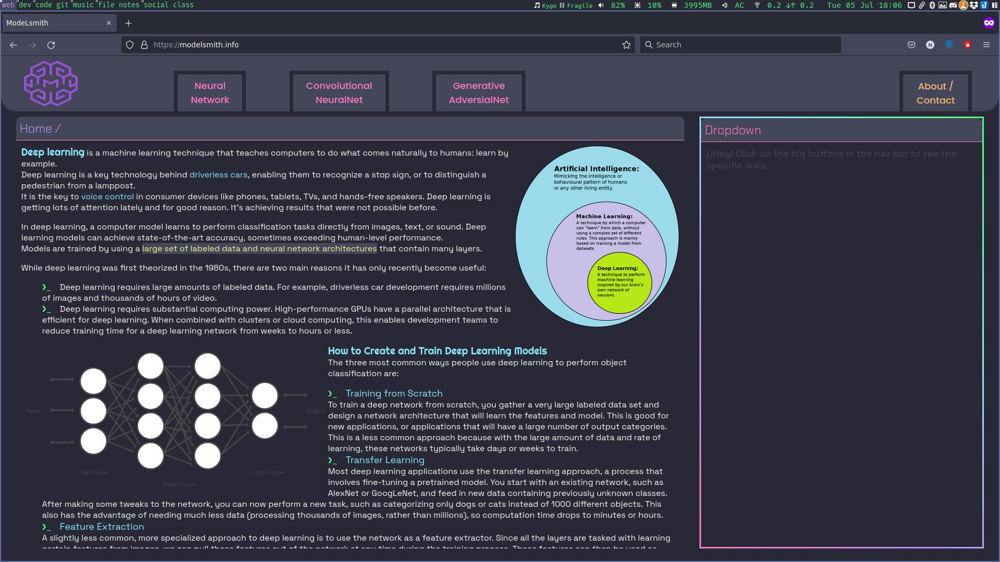

# [ModeLsmith](https://modelsmith.info) 


> A machine learning website based on Django for all of our ML projects.

> *Developers* : [Ankit Kumar](https://github.com/Anky209e),[Ashwani Ahlawat](https://github.com/AshuAhlawat)



> Project Directory Structure
```
.
├── app
│   ├── cnn
│   │   ├── classes
│   │   │   └── __pycache__
│   │   └── __pycache__
│   ├── gans
│   │   ├── classes
│   │   │   └── __pycache__
│   │   ├── migrations
│   │   │   └── __pycache__
│   │   └── __pycache__
│   ├── media
│   │   ├── cnn_images
│   │   ├── gans_images
│   │   └── home
│   ├── models
│   ├── modelsmith
│   │   └── __pycache__
│   ├── nn
│   │   ├── classes
│   │   ├── migrations
│   │   │   └── __pycache__
│   │   └── __pycache__
│   └── templates
│       ├── cnn
│       ├── gans
│       ├── home
│       └── nn
├── cnn
│   ├── classes
│   └── __pycache__
├── gans
│   ├── classes
│   │   └── __pycache__
│   ├── migrations
│   │   └── __pycache__
│   └── __pycache__
├── media
│   ├── gans_images
│   └── home
├── models
├── modelsmith
│   └── __pycache__
├── nn
│   ├── classes
│   ├── migrations
│   │   └── __pycache__
│   └── __pycache__
└── templates
    ├── cnn
    ├── gans
    ├── home
    └── nn
```

## Setting up Environment and Running
```bash
cd /path/to/directory
python -m pip install -r requirements.txt
python manage.py runserver
```

